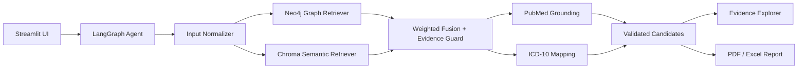

# RareDx

RareDx is an evidence-grounded diagnostic assistant for rare diseases. It combines a Streamlit clinician UI, a LangGraph diagnostic workflow, Neo4j graph retrieval, ChromaDB semantic retrieval, PubMed citation grounding, and ICD-10 mapping to produce traceable ranked diagnostic candidates.

The project is designed around one rule: no evidence, no diagnosis. Candidates must be supported by graph paths or literature citations before they appear in the final report.

## Key Features

- Streamlit clinical intake and results UI
- LangGraph workflow for input normalization, retrieval, fusion, validation, and reporting
- Neo4j graph retrieval over disease-symptom-gene relationships
- ChromaDB semantic retrieval over Orphanet disease profiles
- PubMed grounding and ICD-10 mapping for candidate validation
- Evidence tab with Neo4j graph visualization and citation traceability
- PDF and Excel report exports
- Benchmark runner, ablation sweeps, and top-1 confidence calibration

## Architecture



### Data Flow

1. The clinician enters a note, HPO phenotypes, and genes in Streamlit.
2. LangGraph preserves and normalizes structured inputs.
3. Neo4j retrieves disease candidates connected to selected symptoms and genes.
4. ChromaDB retrieves semantic candidates from Orphanet disease profiles.
5. Fusion combines graph and semantic evidence using configurable weights.
6. Unsupported candidates are dropped unless they have a Neo4j path or PubMed citation.
7. PubMed and ICD-10 helpers enrich validated candidates.
8. The UI renders ranked candidates, graph evidence, citations, audit trail, and downloadable reports.

## Tech Stack

| Layer | Tools |
| --- | --- |
| UI | Streamlit |
| Agent orchestration | LangGraph |
| Graph store | Neo4j |
| Semantic store | ChromaDB |
| Embeddings | BioLORD via sentence-transformers |
| Evidence grounding | PubMed helper, Orphanet source PMIDs |
| Clinical coding | Local ICD-10 mapping helper |
| Reporting | ReportLab PDF, pandas/openpyxl Excel |
| Evaluation | JSONL benchmark, CSV/JSON metrics, calibration script |

## Setup

### Prerequisites

- Python 3.11+
- Docker and Docker Compose
- `.env` file with required credentials

### Install

```bash
cp .env.example .env
python -m pip install --upgrade pip
python -m pip install -r requirements.txt
```

Edit `.env` and set:

- `GROQ_API_KEY`
- `NEO4J_URI`
- `NEO4J_USER`
- `NEO4J_PASSWORD`

Optional values:

- `CHROMA_HOST`
- `CHROMA_PORT`
- `BIOLORD_MODEL_NAME`
- `GRAPH_WEIGHT` and `SEMANTIC_WEIGHT`, which must sum to `1.0`
- `NCBI_API_KEY`

### Start Services

```bash
docker-compose up -d
```

### Ingest Knowledge Stores

```bash
python scripts/ingest_graph.py
python scripts/ingest_semantic.py --reset
```

Semantic ingestion builds Chroma disease profiles from Orphanet disease names, synonyms, phenotypes, genes, and source PMIDs.

### Launch App

```bash
streamlit run app.py
```

## Project Structure

| Path | Purpose |
| --- | --- |
| `app.py` | Streamlit application and user workflow |
| `core/agent.py` | LangGraph diagnostic workflow |
| `core/retriever.py` | Neo4j and ChromaDB retrieval |
| `core/config.py` | Pydantic settings and validation |
| `components/graph_visualizer.py` | Evidence-tab Neo4j graph renderer |
| `mcp/` | PubMed, ICD-10, and FHIR helper modules |
| `scripts/ingest_graph.py` | Neo4j graph ingestion |
| `scripts/ingest_semantic.py` | Chroma semantic ingestion |
| `scripts/evaluate.py` | Benchmark runner and metrics export |
| `scripts/calibrate.py` | Top-1 confidence calibration |
| `data/eval/rare_disease_cases.jsonl` | 40-case benchmark dataset |
| `data/eval/exp-results/` | Local benchmark outputs and calibration artifacts |
| `tests/` | Unit tests for agent, retriever, graph visualization, and calibration |
| `docs/` | API contracts, troubleshooting, and reference docs |

## Evaluation

Run the current configured fusion strategy:

```bash
python scripts/evaluate.py --all
```

Run ablations:

```bash
python scripts/evaluate.py --all --ablation
```

Run custom fusion sweeps:

```bash
python scripts/evaluate.py --all \
  --weight-sweep 0.7:0.3 \
  --weight-sweep 0.5:0.5 \
  --weight-sweep 0.3:0.7
```

The evaluator writes under `data/eval/exp-results/` by default:

- `results_<timestamp>.csv`: per-case candidates, scores, evidence fields, ICD-10 mapping, and runtime
- `summary_<timestamp>.json`: grouped diagnostic and evidence/safety metrics
- `summary_<timestamp>.csv`: spreadsheet-friendly metrics

## Benchmark Results

Latest local benchmark artifact: `data/eval/exp-results/summary_20260429_221029.json`

Scope: 40 curated rare-disease benchmark cases, 7 retrieval strategies, 280 strategy-case evaluations, 0 failures.

Best strategy: `fusion_30_70`, tied with `semantic_only` on Top-1, Recall@5, and MRR. The fused strategy is the stronger default because it preserves Neo4j graph evidence while matching semantic-only diagnostic quality.

### Diagnostic Ranking

Best-strategy metrics:

| Metric | Value |
| --- | ---: |
| Cases evaluated | 40 |
| Top-1 accuracy | 0.925 |
| Recall@3 | 1.000 |
| Recall@5 | 1.000 |
| MRR | 0.958 |
| Median true rank | 1.0 |
| No-result rate | 0.000 |

### Ablation Results

| Strategy | Top-1 | Recall@5 | MRR | Median rank |
| --- | ---: | ---: | ---: | ---: |
| `fusion_30_70` | 0.925 | 1.000 | 0.958 | 1.0 |
| `semantic_only` | 0.925 | 1.000 | 0.958 | 1.0 |
| `fusion_50_50` | 0.925 | 1.000 | 0.954 | 1.0 |
| `fusion_60_40` | 0.875 | 1.000 | 0.918 | 1.0 |
| `fusion_configured` | 0.875 | 1.000 | 0.918 | 1.0 |
| `fusion_70_30` | 0.825 | 1.000 | 0.884 | 1.0 |
| `graph_only` | 0.675 | 0.800 | 0.727 | 1.0 |

### Evidence and Safety

Best-strategy metrics:

| Metric | Value |
| --- | ---: |
| Graph evidence coverage | 0.677 |
| PubMed citation coverage | 0.990 |
| ICD-10 mapping coverage | 0.927 |
| Unsupported candidate drop rate | 0.003 |
| Hallucination / unsupported-output rate | 0.000 |

### Runtime

| Metric | Value |
| --- | ---: |
| Runtime p50 | 6,414 ms |
| Runtime p95 | 8,177 ms |

## Confidence Calibration

Calibrate top-1 confidence from an evaluation CSV:

```bash
python scripts/calibrate.py \
  --results data/eval/exp-results/results_20260429_221029.csv \
  --timestamp 20260429_221029
```

Latest local calibration artifact: `data/eval/exp-results/calibration_20260429_221029.json`

| Metric | Value |
| --- | ---: |
| Observed Top-1 accuracy | 0.861 |
| Mean calibrated confidence | 0.862 |
| Brier score | 0.068 |
| Expected calibration error | 0.051 |
| Maximum calibration error | 0.290 |
| Negative log likelihood | 0.233 |

Calibration is provisional because the benchmark currently has 40 cases. It is useful for UI confidence display, but should be re-fit as the benchmark grows to 100+ cases.

## Repository Hygiene

- Keep source benchmark cases in `data/eval/rare_disease_cases.jsonl`.
- Treat `data/eval/exp-results/` as generated experiment output.
- Keep local service volumes such as `data/neo4j_data/` and `data/chroma_data/` out of commits.
- Re-run tests after retrieval, evaluation, or UI changes:

```bash
python -m unittest tests/test_agent.py tests/test_retriever.py tests/test_graph_visualizer.py tests/test_calibrate.py tests/test_semantic_ingest.py
```

## Troubleshooting

See `docs/TROUBLESHOOTING.md` for common issues when starting services, loading data, or running the app.

## API Contracts

See `docs/API_CONTRACTS.md` for layer contracts between the UI, agent, retriever, and reporting components.
